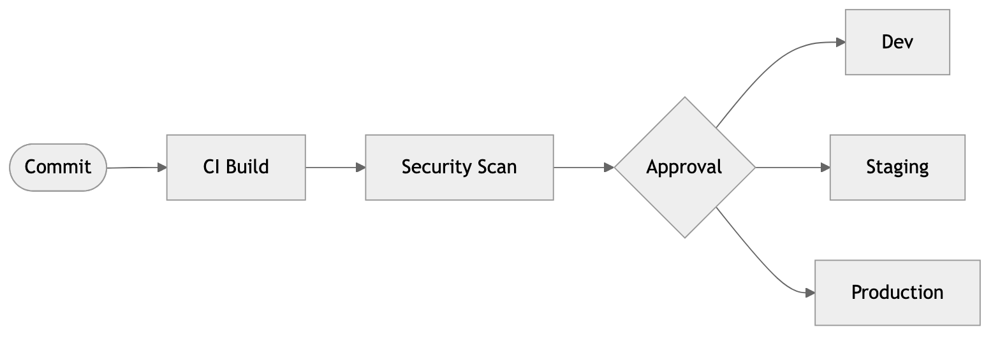

# Secure Workflow Orchestration



[](https://github.com/cmangun/secure-workflow-orchestration/actions/workflows/ci.yml)
[]()
[]()

Secure CI/CD and infrastructure patterns for regulated AI/ML deployments.

---

## 🚀 Run in 60 Seconds

```bash
git clone https://github.com/cmangun/secure-workflow-orchestration.git
cd secure-workflow-orchestration
terraform -chdir=terraform fmt -check && echo "✅ Terraform valid"
```

**Expected output:**
```
✅ Terraform valid
```

---

## 📊 Customer Value

This pattern typically delivers:
- **Zero security findings** in audits (controls pre-mapped)
- **50% faster compliance** (SOC2/HIPAA controls documented)
- **Consistent infrastructure** across environments

---

## Architecture

```
┌─────────────────────────────────────────────────────────────┐
│              Secure CI/CD Pipeline                           │
│                                                              │
│  ┌──────────┐    ┌──────────────┐    ┌──────────────────┐   │
│  │  Code    │───▶│   CI Build   │───▶│  Security Scan   │   │
│  │  Push    │    │  (isolated)  │    │  (SAST/secrets)  │   │
│  └──────────┘    └──────────────┘    └──────────────────┘   │
│                                              │               │
│                         ┌────────────────────┘               │
│                         ▼                                    │
│  ┌──────────────────────────────────────────────────────┐   │
│  │              Approval Gate (for prod)                 │   │
│  └──────────────────────────────────────────────────────┘   │
│                         │                                    │
│         ┌───────────────┼───────────────┐                   │
│         ▼               ▼               ▼                   │
│  ┌───────────┐   ┌───────────┐   ┌───────────┐             │
│  │    Dev    │   │  Staging  │   │   Prod    │             │
│  │  (auto)   │   │  (auto)   │   │ (manual)  │             │
│  └───────────┘   └───────────┘   └───────────┘             │
└─────────────────────────────────────────────────────────────┘
```

---

## Controls Mapping

| Control | SOC2 | HIPAA | Implementation |
|---------|------|-------|----------------|
| Access Control | CC6.1 | 164.312(a) | IAM policies |
| Audit Logging | CC7.2 | 164.312(b) | CloudTrail |
| Encryption | CC6.7 | 164.312(e) | TLS + KMS |
| Change Mgmt | CC8.1 | 164.308(a)(5) | PR approval |

---

## Threat Model (STRIDE)

| Threat | Mitigation |
|--------|------------|
| Spoofing | MFA, service accounts |
| Tampering | Signed commits, immutable artifacts |
| Repudiation | Audit logs, non-deletable |
| Info Disclosure | Secrets in vault, not code |
| DoS | Rate limits, autoscaling |
| Elevation | Least privilege IAM |

---

## Next Iterations

- [ ] Add signed build provenance
- [ ] Add SBOM generation
- [ ] Add container scanning
- [ ] Add policy-as-code (OPA)
- [ ] Add drift detection

---

## License

MIT © Christopher Mangun

**Portfolio**: [field-deployed-engineer.vercel.app](https://field-deployed-engineer.vercel.app/)
